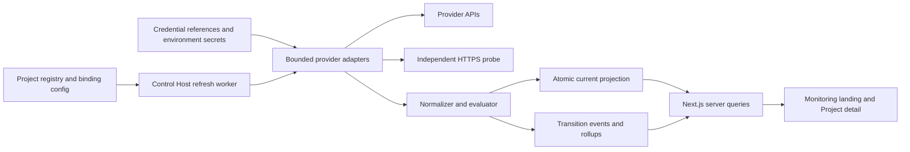

# AllJobs Application Monitoring Design

**Status:** Approved for implementation by Human Owner on 2026-09-11

**Date:** 2026-09-11

**Scope:** Project-scoped service health, deployment, usage, freshness, and bounded cached history

**Tier:** T3 — new routes, external-provider credentials, service-health data, and usage or billing-adjacent data

**Canonical UI Brief:** `.agent/frontend-design/r5-application-monitoring/brief.md`

**Implementation authorization:** Product code and fixture-based verification are authorized using Pactify with worker `kimi` (K3), independent reviewer `claude`, and the primary agent driving acceptance. Credential creation, live-provider mutation, production deployment, push, and release remain unauthorized.

## 1. Purpose

AllJobs needs one daily operations view that lets its Human Owner identify, within one minute:

1. which Projects need attention;
2. which provider resource and signal caused that state;
3. whether data is current enough to trust;
4. which usage measures are approaching known allowances; and
5. whether a recent deployment, platform incident, or collection failure is relevant.

The initial integration target is Railway, Fly.io, Neon, and Supabase. Vercel, Cloudflare, and GitHub fit the same adapter model but enter only according to the phased scope in this design.

Monitoring is an operational projection, not a second provider control plane. All provider access is read-only. The initial release does not deploy, restart, remediate, notify, reconcile invoices, or let a browser expand provider authority.

## 2. Human-approved product decisions

1. The primary use case is a daily overview, not a full observability or billing product.
2. Project-to-provider-resource bindings are explicit Human-owned configuration. Heuristics may suggest candidates later but cannot create bindings.
3. The Control Host collects provider data on a schedule and serves cached normalized projections. Page rendering never fans out to providers.
4. The cache retains bounded normalized history so deterministic analysis can be added without storing raw provider responses.
5. Health dimensions remain separate: collector, deployment, runtime, usage, platform incident, and freshness are not collapsed into an opaque score.
6. The landing page uses a Project-first workbench with a compact attention-first queue above the complete Project ledger.
7. Project detail follows Project → Provider Binding → Signal and exposes the reason and evidence behind the aggregate state.
8. Attention uses explainable `critical`, `warning`, `unknown`, `watch`, and `healthy` states.
9. Missing, stale, unsupported, or unauthorized data is visible and can never silently become healthy.
10. The initial analysis surface may state deterministic trends and timing relationships but cannot claim causal root cause.

## 3. Non-goals

The initial release does not include:

- log ingestion, trace ingestion, or arbitrary metrics scraping;
- Grafana, Prometheus storage, a database, or a general time-series platform;
- alert delivery by email, SMS, chat, push, or webhook;
- automatic restart, rollback, scale, deploy, or configuration mutation;
- invoice reconciliation or a claim that operational usage equals billed cost;
- AI-generated incident analysis, autonomous investigation, or remediation;
- browser-entered provider credentials or arbitrary browser-defined probe URLs;
- automatic discovery that creates or changes provider bindings;
- multi-owner tenancy or a second Control Host.

## 4. Provider feasibility and launch boundary

Provider capability is uneven. “Usage” must therefore preserve provenance and billing alignment rather than pretending every platform exposes the same billable facts.

| Provider | Health and deployment feasibility | Usage feasibility | Initial treatment |
|---|---|---|---|
| Railway | Public GraphQL API exposes deployments and statuses. Railway deployment healthchecks validate deployment startup but are not continuous external uptime checks. | Metrics and usage are available, but billing interpretation must remain provider-labeled. | Core adapter. Add an independent bounded HTTPS probe when runtime health is required. |
| Fly.io | Machines REST state, configured health checks, and organization Prometheus metrics provide operational evidence. | Operational resource metrics are feasible; a stable public invoice-grade usage API was not identified in the research baseline. | Core adapter. Show operational usage and mark billing usage unavailable. |
| Neon | Compute endpoint state and platform status are feasible. | Consumption API provides invoice-aligned measures on eligible paid plans; availability and update cadence are plan-dependent. | Core adapter. Fall back to supported project measures when consumption access is unavailable. |
| Supabase | Management API project health and service health are feasible. | Request and Postgres metrics are feasible; complete organization billable usage is not uniformly exposed through one stable endpoint. | Core adapter. Keep service health, operational metrics, and billable claims separate. |
| Vercel | Deployments and Checks have strong API coverage. | REST/CLI usage and billing charges have strong current feasibility, subject to account permissions. | First extension after core contracts; may ship in the same release if credential validation passes. |
| GitHub | Actions workflow runs and repository status are strongly supported by fine-grained read scopes. | Enhanced billing usage availability depends on account type and feature access. | First extension for workflow health; usage remains capability-detected. |
| Cloudflare | Pages and Workers deployments plus GraphQL analytics are feasible. | Analytics are operational, not necessarily billable; Billing Usage API is restricted/alpha in the research baseline. | Second extension. Start with AllJobs-owned Pages/Workers/Tunnel-adjacent operational signals; do not block core launch. |

Capability rules:

- every adapter declares supported signals and required permissions;
- unsupported optional facts become `not_available`, not synthetic zeroes;
- billing alignment is one of `exact`, `provider_estimate`, or `operational_only`;
- feature availability is capability-detected at collection time and retained in snapshot evidence;
- the UI never labels a measure “cost” or “allowance” unless the provider reports that meaning.

## 5. Architecture

All monitoring work extends the existing single-Control-Host topology.



### 5.1 Collection path

1. The existing refresh process begins one non-overlapping collection cycle.
2. It loads registered Projects and their explicit monitoring bindings.
3. It resolves credential references server-side from Control Host configuration and environment variables.
4. It invokes only fixed read-only adapter operations with bounded concurrency, timeouts, response-size limits, and per-provider backoff.
5. Each adapter returns provider-shaped evidence without writing cache files directly.
6. The normalizer converts evidence into versioned signal contracts.
7. The evaluator derives binding and Project attention states with machine-readable reasons.
8. Successfully evaluated current projections are written atomically.
9. Material transitions and rollups are appended under the single worker/lock boundary.
10. The Next.js application reads local projections only.

One adapter failure cannot abort successful results from other adapters. The collector publishes a partially complete cycle with explicit collector states rather than replacing failures with empty values.

### 5.2 Manual refresh

Manual refresh is a same-origin POST or Server Action that accepts only an already registered Project or binding identifier. It cannot accept credentials, provider endpoints, queries, or arbitrary resource IDs.

The action:

- enqueues the same collection path used by the scheduled worker;
- respects global single-flight, provider backoff, and minimum intervals;
- returns `queued`, `collecting`, `partially_complete`, `complete`, or `backing_off` plus the currently served snapshot identity;
- never holds the page request open for an unbounded provider fan-out; and
- preserves the previous atomic projection throughout collection.

## 6. Configuration and binding model

Bindings belong to the AllJobs-native Project registry because the Project is their ownership boundary. A new optional `monitoring.bindings` field extends each Project JSON document. It contains identifiers and safe configuration, not credentials.

```json
{
  "monitoring": {
    "bindings": [
      {
        "id": "railway-production-api",
        "provider": "railway",
        "resource_kind": "service",
        "resource_id": "provider-resource-id",
        "environment": "production",
        "expected_runtime": "always-on",
        "required_signals": ["deployment", "runtime"],
        "credential_ref": "railway-primary",
        "console_url": "https://railway.com/...",
        "probe": {
          "host_ref": "talentvault-production",
          "method": "GET",
          "expected_status": [200],
          "timeout_ms": 5000
        }
      }
    ]
  }
}
```

`MonitoringBinding` fields:

| Field | Contract |
|---|---|
| `id` | Stable and unique within the Project; lowercase identifier used for cache identity |
| `provider` | Closed adapter set: `railway`, `fly`, `neon`, `supabase`, `vercel`, `cloudflare`, or `github` |
| `resource_kind` | Provider adapter’s closed resource-kind set; never controls an arbitrary endpoint |
| `resource_id` | Opaque provider identifier passed only to the selected adapter’s fixed operations |
| `environment` | Human-owned environment label such as `production` or `preview` |
| `expected_runtime` | `always-on`, `scale-to-zero`, `scheduled`, or `manual` |
| `required_signals` | Subset of adapter-supported signals that must be current and good for `healthy` |
| `credential_ref` | Lookup key into Control Host credential metadata; never the secret value |
| `console_url` | Validated HTTPS link whose hostname is in the selected adapter's fixed provider-console allowlist |
| `probe` | Optional bounded probe policy referencing a Control Host-allowlisted hostname |

Control Host configuration maps `credential_ref` to a provider and the name of an environment variable. Secret values exist only in the launchd/runtime environment or an equivalently protected host secret source. They are never serialized into repository files, cache, logs, API responses, HTML, or browser storage.

Bindings are changed through the existing Human-gated native-write pattern: proposed diff, validation, digest protection, explicit confirmation, atomic replacement, and activity evidence. Automatic discovery may later produce a copy-only suggestion but cannot bypass this path.

## 7. Normalized contracts

### 7.1 Snapshot identity

Every collection result carries:

- `schema_version`;
- `cycle_id`;
- `binding_id` and Project slug;
- provider and resource identity;
- `attempted_at` for the latest collection attempt;
- signal-specific `observed_at` timestamps;
- adapter capability and version metadata; and
- zero or more machine-readable `reasons`.

### 7.2 Signal dimensions

```ts
type MonitoringSnapshot = {
  schema_version: 1;
  cycle_id: string;
  project: string;
  binding_id: string;
  provider: MonitoringProvider;
  collector: CollectorSignal;
  deployment: DeploymentSignal | null;
  runtime: RuntimeSignal | null;
  usage: UsageMeasure[];
  platform_incident: PlatformIncidentSignal | null;
  freshness: FreshnessSignal;
  attention: AttentionLevel;
  reasons: AttentionReason[];
};
```

Dimensions remain independent:

- `collector`: success, authentication, permission, rate limit, timeout, malformed response, or unsupported capability;
- `deployment`: queued, building, succeeded, failed, cancelled, unavailable, or not applicable;
- `runtime`: healthy, degraded, unhealthy, expected idle/stopped, unknown, or not applicable;
- `usage`: one or more typed measures with period and billing alignment;
- `platform_incident`: related incident identity, severity, status, and provider timestamp;
- `freshness`: signal-specific trust based on observation time and maximum age.

### 7.3 Usage measure

```ts
type UsageMeasure = {
  metric: string;
  value: number;
  unit: string;
  period_start: string;
  period_end: string;
  allowance?: number;
  cost?: number;
  currency?: string;
  provider_reported_at: string;
  billing_alignment: "exact" | "provider_estimate" | "operational_only";
  availability: "available" | "not_available";
};
```

The system does not convert unlike units into a universal percentage or cost. Percentage bands apply only when an allowance for the same metric, unit, and period is known.

## 8. Attention state evaluation

Aggregate precedence is:

```text
critical → warning → unknown → watch → healthy
```

A higher-precedence reason controls the landing-page state. All applicable reasons remain visible in Project and binding detail.

| Level | Deterministic trigger |
|---|---|
| `critical` | A required runtime or independent probe is confirmed unhealthy; a required provider service is explicitly unavailable; or quota exhaustion has observed service impact |
| `warning` | Latest production deployment failed; required runtime is repeatedly degraded but not confirmed down; known allowance is at least 90%; or a related active platform incident threatens the binding |
| `unknown` | A required signal has no trustworthy current value because authorization, permission, unsupported configuration, first collection, or maximum-age expiry prevents evaluation |
| `watch` | Known allowance is at least 75% but below 90%; a deterministic sustained trend crosses its configured band; or collection is delayed while the last trustworthy value remains inside maximum age |
| `healthy` | Every required signal is supported, current, and good; declared expected idle, sleeping, stopped, scheduled, or scale-to-zero behavior matches policy |

Additional rules:

- usage at or above 100% remains `warning` unless provider or runtime evidence shows actual service impact;
- a single transient probe failure may be `warning`; confirmed failure requires the binding’s bounded consecutive-failure rule;
- optional unsupported metrics do not affect attention;
- configuring an unsupported metric as required is a binding validation failure and evaluates to `unknown`;
- missing optional platform status cannot alone downgrade otherwise trustworthy resource signals;
- no arithmetic or AI-generated composite health score exists.

## 9. Freshness and failure semantics

Freshness is signal-specific. Each adapter declares its planned cadence and maximum trustworthy age because provider usage may update much more slowly than runtime state.

| Condition | Cache behavior | UI behavior |
|---|---|---|
| Successful collection | Replace the signal value atomically and advance `observed_at` | Show current value and age |
| Timeout or malformed response | Record collector error and `attempted_at`; retain last trustworthy value | Show last value plus delayed-collection reason; become `unknown` only after maximum age |
| Rate limit | Retain last value and record provider retry/backoff metadata | Show `backing_off`; manual refresh cannot bypass it |
| Authentication or permission failure | Retain historical evidence but mark affected required signals untrustworthy immediately | `unknown` with actionable credential/scope reason; never display the secret |
| Unsupported optional signal | Persist capability as unavailable | Show `N/A`; no downgrade |
| Unsupported required signal | Reject or invalidate the binding contract | `unknown` until corrected |
| First collection has no value | Publish collector evidence without inventing a signal | `unknown` for required signals |
| One adapter fails | Publish successful adapters and isolated failure evidence | Other Projects and bindings remain current |
| Platform status source fails | Isolate from resource signals | Visible in detail; no downgrade when optional |

Repeated identical failures update attempt metadata but do not append duplicate transition events. A new event is written only for material attention, signal state, deployment identity, permission state, or quota-band changes.

## 10. Cache and history

Mutable monitoring state lives outside the repository under the Control Host state root. The product checkout remains source code plus canonical Project configuration; generated observations never enter Git.

```text
~/.alljobs/state/monitoring/
  current/
    index.json
    generations/<cycle-id>/<project>/<binding-id>.json
  events/
    YYYY-MM.jsonl
  rollups/
    hourly/YYYY-MM.jsonl
    daily/YYYY.jsonl
  locks/
    collector.lock
```

### 10.1 Current projection

- A cycle writes a complete immutable generation under `current/generations/<cycle-id>/`. Failed bindings receive a new snapshot containing their retained last trustworthy signals plus the new collector attempt evidence.
- Each generation file is written through a temporary sibling file and atomic rename.
- `current/index.json` is written last through atomic replacement and contains Project aggregates, exact generation references, cycle status, and collection timestamps. The index switch is the visibility boundary for the whole cycle.
- Queries read the index first and reject schema versions or referenced snapshots that fail validation.
- A corrupt new write cannot erase the previous known-good projection.
- The current directory retains only the active and immediately previous snapshot generation needed for safe pointer replacement and recovery.

### 10.2 Transition events

Monthly JSONL records contain only normalized material changes:

- Project and binding identity;
- event type and previous/new state;
- reason code;
- provider revision or deployment identifier when applicable;
- observed and recorded timestamps; and
- confidence/provenance metadata.

They do not contain raw responses, logs, request bodies, headers, credentials, environment values, or application/business content.

### 10.3 Rollups and retention

- hourly rollups retain `min`, `max`, `last`, and `count` for 90 days;
- daily rollups retain the same bounded statistics for 13 months;
- transition events are retained for 13 months unless the Human Owner later approves a shorter period;
- cleanup operates only under the resolved monitoring state root, uses explicit validated filenames, and runs after a successful rollup;
- retention failure leaves data in place and reports a collector issue; it never deletes broad or unresolved paths.

This is sufficient for later burn-rate, anomaly, deployment-to-health correlation, connector-staleness, and quota-band analysis without introducing a database now.

## 11. UI information architecture

### 11.1 Landing page

Route: `/monitoring`

Order:

1. provenance strip showing cached projection and collection age;
2. scope/trust summary: Projects, bindings, needs attention, freshness;
3. `Needs attention` queue containing only actionable or unavailable items;
4. complete Project ledger sorted by attention precedence and then name.

Every Project appears once in the ledger with aggregate state, binding summary, leading reason, freshness, and an Open action. Healthy Projects remain visible but do not enter the attention queue.

### 11.2 Project detail

Route: `/monitoring/[project]`

Order:

1. Project attention level and leading reason;
2. provider-binding comparison table;
3. expanded binding signal matrix;
4. recent normalized evidence and bounded deterministic interpretation.

The detail page must make mixed evidence explicit. For example, a deployment may be succeeded while a required runtime probe is failed; the latter drives `critical` without rewriting deployment truth.

### 11.3 Responsive behavior

Desktop uses dense workbench tables. At narrow widths:

- order remains summary → attention → complete Projects;
- rows become labeled blocks rather than horizontally clipped mini-tables;
- status, provider/resource, reason, freshness, and action remain visible;
- no critical information depends on hover or color alone; and
- targets remain usable on coarse pointers.

## 12. Security and privacy boundaries

### 12.1 Provider credentials

- Prefer provider-native read-only or fine-grained tokens.
- Railway GraphQL calls use a fixed query allowlist. Although transport uses POST, mutation documents are rejected.
- Providers whose personal tokens are broader than desired are constrained by application-level fixed operations and resource allowlists until better OAuth/scoped credentials are available.
- Tokens are looked up only on the server and are redacted from structured errors.
- Token validation or rotation is a Control Host operation and is never exposed through the monitoring browser UI.

### 12.2 Probe SSRF boundary

Independent probes are the only adapter operation that could otherwise become an arbitrary network fetch. The initial contract therefore requires:

- HTTPS only;
- no embedded user information, custom headers, request body, or browser-provided URL;
- hostname selected through a Control Host `probeAllowedHosts` reference rather than a raw binding URL;
- exact hostname validation and DNS resolution checks that reject loopback, link-local, private, multicast, and otherwise non-routable addresses unless a separate explicit Control Host allowlist is approved;
- no automatic cross-host redirects;
- fixed GET or HEAD methods, a short timeout, bounded redirects, bounded response metadata, and no persisted response body; and
- expected status codes configured by the Human Owner, allowing cases such as an intentional Access redirect without following it.

### 12.3 Web boundary

- Production remains on `127.0.0.1:3456` behind the existing Cloudflare Tunnel and Access policy.
- Monitoring routes never introduce a LAN listener or second public origin.
- Refresh is same-origin, non-idempotent POST behavior with origin checks and `no-store` responses.
- Route input selects only already registered identifiers and cannot supply provider queries or endpoints.
- UI error text is normalized and cannot include secret-bearing provider payloads.

### 12.4 Stored data

The cache stores operational metadata that may be commercially sensitive. It remains on the Control Host under the same backup and filesystem-access boundary as other `~/.alljobs` state. Browser responses include only the fields needed for the selected Project view and never bulk-export history by default.

## 13. Adapter contract

Each adapter implements a closed contract similar to:

```ts
interface MonitoringAdapter {
  provider: MonitoringProvider;
  capabilities(binding: MonitoringBinding): AdapterCapabilities;
  validateBinding(binding: MonitoringBinding): BindingValidation;
  collect(input: CollectInput, signal: AbortSignal): Promise<ProviderEvidence>;
  normalize(evidence: ProviderEvidence, context: NormalizeContext): MonitoringSnapshot;
}
```

Rules:

- adapters do not read browser input or write storage;
- adapter endpoints, request shapes, methods, and maximum response sizes are fixed in code;
- every request has an abort deadline;
- backoff and concurrency are provider-specific but enforced by the shared collector;
- errors map to a closed collector taxonomy;
- provider timestamps remain distinct from Control Host receipt time;
- fixture contracts remove network dependence from unit tests; and
- a new adapter cannot ship until it passes the common adapter conformance suite.

## 14. Proposed code boundaries

The eventual implementation should remain isolated from Planning Core source resolution:

```text
lib/monitoring/
  domain/          schemas, types, attention evaluator
  adapters/        one folder per provider plus conformance contract
  collector/       scheduler, single-flight, backoff, probe boundary
  store/           atomic current projection, events, rollups, retention
  queries/         landing and Project-detail projections
app/monitoring/
  page.tsx
  [project]/page.tsx
app/actions/
  monitoring-refresh.ts
```

The existing refresh worker may orchestrate monitoring through a separate module, but monitoring failures cannot fail the Git planning refresh. If operational coupling makes this guarantee difficult, use a second launchd worker process that shares Control Host configuration but not failure fate; do not add a new public service.

## 15. Phased delivery

### Phase 0 — contracts and safe collection foundation

- Project binding schema and digest-protected Human editing path;
- Control Host credential references and configuration validation;
- normalized domain, state evaluator, storage, single-flight, backoff, and probe boundary;
- fixture adapter for end-to-end state-matrix verification;
- no production provider credentials required to complete this phase.

### Phase 1 — core providers and approved UI

- Railway, Fly.io, Neon, and Supabase adapters;
- `/monitoring` B+A landing page and `/monitoring/[project]` detail;
- scheduled and manual refresh;
- current cache, transition events, hourly/daily rollups, and retention;
- responsive state matrix including partial/unknown/stale/backoff cases;
- one Human-selected pilot Project before expanding bindings.

### Phase 2 — high-feasibility extensions

- Vercel deployment, checks, and capability-detected usage;
- GitHub Actions workflow health and capability-detected usage;
- Cloudflare Pages/Workers operational signals and analytics, without implying invoice-grade usage;
- related platform incident projection where provider status feeds are stable.

Vercel may move into the Phase 1 release if its adapter meets the same credential, conformance, and verification gates. Core launch does not wait for extension-provider billing coverage.

### Phase 3 — cached analysis

- quota burn rate and threshold-crossing forecasts;
- deployment-to-health timing correlation;
- sustained anomaly and connector-staleness detection;
- comparison across normalized periods and billing alignments.

Phase 3 starts with deterministic methods. Any AI-written analysis, alerting, or remediation requires a new design and Human Gate.

## 16. Test and verification strategy

### 16.1 Domain and adapter tests

- exhaustive attention precedence and reason retention;
- expected-runtime policy for always-on, scale-to-zero, scheduled, and manual resources;
- provider fixture normalization and capability detection;
- authentication, permission, rate limit, timeout, malformed response, unsupported signal, and partial-cycle behavior;
- usage unit, period, allowance, cost, and billing-alignment preservation;
- adapter request allowlists and rejection of mutations or arbitrary endpoints.

### 16.2 Storage tests

- atomic current replacement and corrupt-write recovery;
- last trustworthy value preservation after collection failure;
- index/schema validation;
- transition deduplication;
- hourly and daily rollup correctness;
- exact retention path validation and safe cleanup failure;
- no secret/raw-body fields in serialized fixtures.

### 16.3 Security boundary tests

- credentials never cross server contracts or appear in rendered payloads/errors;
- probe rejects non-HTTPS, userinfo, private/loopback/link-local/multicast targets, cross-host redirects, custom bodies, and non-allowlisted hosts;
- refresh rejects arbitrary provider/resource input and cross-origin requests;
- provider failure cannot expand query scope or invoke a mutation.

### 16.4 UI and journey tests

- every approved attention and collection state on landing and detail routes;
- mixed deployment/runtime evidence;
- partial provider success, stale value, expired credential, unsupported optional metric, first collection, empty binding set, refresh/backoff, and corrupt-cache recovery states;
- keyboard, focus, screen-reader status, reduced motion, and color-independent meaning;
- desktop and real 390px mobile rendering using the repository screenshot path;
- final screenshots from the final production build, not a development server.

### 16.5 Release verification

- independent design review before implementation;
- independent code review and verification against the final candidate commit;
- credential-scope and serialized-output inspection;
- Control Host loopback binding and Cloudflare Access checks;
- scheduled collection evidence plus one bounded manual refresh;
- one known-good binding and one controlled failure/unknown scenario;
- Human Owner walkthrough and explicit release approval.

## 17. Rollout and rollback

Monitoring is feature-disabled until configuration and at least one pilot binding validate. Rollout sequence:

1. deploy contracts and collector disabled;
2. configure read-only credential reference and one pilot binding on the Control Host;
3. run one-shot collection and inspect serialized output for scope and secret leakage;
4. enable scheduled collection for the pilot;
5. enable monitoring routes for the Human Owner;
6. expand bindings provider by provider only after evidence remains stable;
7. add extension providers independently.

Rollback disables monitoring routes and collection while leaving Planning Core, the existing refresh path, tunnel, domain, and Access unchanged. Cached monitoring state is preserved for inspection and can be removed later only through a separately confirmed, explicitly scoped operation.

## 18. Acceptance criteria

The design is satisfied only when:

1. the Human Owner can identify every Project needing attention, its provider binding, reason, and data age within one minute;
2. the page performs no inline provider fetch;
3. all bindings are explicit and Human-owned;
4. all provider operations are fixed and read-only;
5. required missing or stale signals never produce healthy;
6. deployment, runtime, usage, platform incident, collector, and freshness remain separately inspectable;
7. usage preserves units, periods, allowance provenance, and billing alignment;
8. one adapter failure cannot erase the last trustworthy value or invalidate other adapters;
9. current snapshots are atomic, transition events are deduplicated, and rollups obey bounded retention;
10. no credential, raw provider response, log body, request body, environment value, or source content is persisted in monitoring cache;
11. the independent probe satisfies the SSRF boundary;
12. desktop and 390px mobile states match the approved landing/detail information architecture;
13. independent Review and Verification pass against the final candidate commit; and
14. release occurs only after Human Owner walkthrough and approval.

## 19. Research references

Official provider references used for the feasibility baseline:

- Railway: [Public API](https://docs.railway.com/integrations/api), [deployment API](https://docs.railway.com/integrations/api/manage-deployments), [healthchecks](https://docs.railway.com/deployments/healthchecks), [CLI usage](https://docs.railway.com/cli/usage), and [CLI metrics](https://docs.railway.com/cli/metrics)
- Fly.io: [Machines resource](https://fly.io/docs/machines/api/machines-resource/), [metrics](https://fly.io/docs/monitoring/metrics/), and [tokens](https://fly.io/docs/security/tokens/)
- Neon: [consumption and network transfer](https://neon.com/docs/introduction/network-transfer), [compute endpoints](https://neon.com/docs/manage/endpoints/), and [platform status](https://neon.com/platforms)
- Supabase: [Management API](https://supabase.com/docs/reference/api/introduction), [service health](https://supabase.com/docs/reference/api/v1-get-services-health), [API request usage](https://supabase.com/docs/reference/api/v1-get-project-usage-api-count), and [metrics](https://supabase.com/docs/guides/observability/metrics)
- Vercel: [REST API](https://vercel.com/docs/rest-api), [billing usage and cost API](https://vercel.com/changelog/access-billing-usage-cost-data-api), and [CLI usage](https://vercel.com/docs/cli/usage)
- GitHub: [Actions workflow runs](https://docs.github.com/en/rest/actions/workflow-runs?apiVersion=2026-03-10) and [billing usage](https://docs.github.com/en/rest/billing/usage)
- Cloudflare: [GraphQL Analytics API](https://developers.cloudflare.com/analytics/graphql-api/), [Billing Usage API](https://developers.cloudflare.com/api/resources/billing/subresources/usage/methods/get/), [Pages deployments](https://developers.cloudflare.com/api/resources/pages/subresources/projects/subresources/deployments/methods/list/), [Workers deployments](https://developers.cloudflare.com/api/resources/workers/subresources/scripts/subresources/deployments/methods/list/), and [API permissions](https://developers.cloudflare.com/fundamentals/api/reference/permissions/)

These links establish feasibility, not a permanent compatibility guarantee. Implementation must revalidate current API contracts, plans, scopes, and rate limits before each adapter is written.
