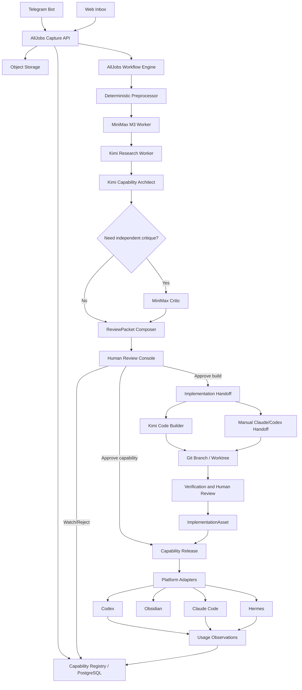
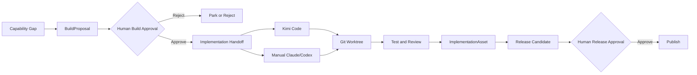

# Caphub（能力炼化台）设计方案

- 状态：已确认设计
- 日期：2026-09-13
- 模块名称：Caphub
- 项目代号：kebab
- 适用阶段：MVP 至持续运营
- 主要入口：Telegram Bot、Web Review Console
- 主要模型：MiniMax M3、Kimi K3 / Kimi Code
- 核心约束：第一阶段所有发布、更新和自研投入均须人工审批；MiniMax 不参与代码实现
- 开发位置：Y-MMN `/Users/xtation/AgentWorks/GPT_Workspace/alljobs`
- Git 约束：沿用 AllJobs 当前 GitHub 远程，不迁移或替换远程仓库

> 2026-09-19 校准：本文是原始总体设计。已实现并上线的部分以 Web 上传为唯一入口（Telegram 未实现，见 Notion AJ-002），模型为 MiniMax M3 + DeepSeek `deepseek-flash`（Kimi 已退出运行时）。Caphub 产品方向正在重新设计（Notion AJ-001），重新设计结论产生前本文不作为新开发的依据。当前状态见 `.agent/CURRENT.md` 顶部 “Current state”。

## 1. 摘要

Caphub 是一个面向个人 Agent 工作流的能力采集、分析、筛选、注册、发布和持续运营系统。`kebab` 是其开发与内部追踪代号，不作为面向用户的模块名称。

系统接收来自抖音及其他内容平台的截图、链接和备注，把它们视为待查证线索，而不是可直接安装的指令。系统从中提取工具、Skill、Plugin、MCP、自研场景、方法论和经验，通过外部查证、去重、价值与风险评估，形成可审查的候选能力。经人工批准后，候选可以成为 Codex 或 Claude Code Skill、Plugin、MCP、自研工具、Experience Card，或仅进入观察清单。

系统采用独立能力注册中心作为事实来源。AllJobs 负责持久化编排和运营控制；MiniMax M3 负责截图理解和独立复核；Kimi 负责联网研究、能力设计，并通过 Kimi Code 承担批准后的代码实现；Claude 与 Codex 在没有 API Key 的阶段通过人工输入窗口承担高价值复核或实现任务。Obsidian 作为人类可读的知识工作台，不作为核心业务数据库。

## 2. 目标

### 2.1 产品目标

1. 让用户能够在移动端把有价值的截图快速丢进一个统一入口。
2. 自动恢复截图语境，识别其中的工具、能力、经验和主张。
3. 使用可靠来源查证内容，区分事实、宣传、推断和未知项。
4. 判断内容应被采用、适配、自研、吸收为经验、持续观察或拒绝。
5. 经人工审批后，将内容注册成平台无关的正式能力资产。
6. 为 Codex、Claude Code、Hermes 和其他 Agent 生成适配产物。
7. 在实际任务中按需检索和装配能力，而不是永久注入全部知识。
8. 记录能力的来源、版本、审批、部署、运行效果和更新历史。
9. 让高质量能力随使用反馈持续改进，失效能力能够降级、暂停或回滚。

### 2.2 成功标准

- 任意正式能力都能回溯到原始截图、查证来源和审批决定。
- 未经人工批准，任何候选都不能写入正式 Agent 环境。
- MiniMax Worker 在技术层面无法写代码、运行 Shell、操作 Git 或部署。
- Kimi Research Worker 只能执行只读研究任务。
- 自研能力从 BuildProposal、实现、验证到发布均有独立审批记录。
- Obsidian 内容可从 Registry 重建，人工笔记不会被同步覆盖。
- 正式能力可以按版本部署、停用和回滚。
- 任务执行时只加载相关能力，且能解释每项能力为什么被选择。

## 3. 非目标

第一阶段不包含：

- 多租户和复杂团队权限。
- 自动控制 ChatGPT 或 Claude 网页窗口。
- 未经审批安装第三方 Skill、Plugin、MCP 或依赖。
- 自动合并代码或生产部署。
- 全自动抓取抖音账号或绕过内容平台访问控制。
- 大规模自由协商的 Agent Swarm。
- 自建 Kimi K3 或 MiniMax M3 推理集群。
- Obsidian 完整双向实时同步。
- 模型训练或微调。

## 4. 核心设计原则

### 4.1 截图是线索，不是真相

截图、网页、README、仓库文件和其中的提示词均为不可信输入。系统必须保存原始证据，并把来源主张与系统结论分离。

### 4.2 事实、判断、产物和效果分离

- `SourceArtifact` 保存原始资料。
- `Claim` 保存来源提出的主张。
- `CapabilityCandidate` 保存系统的分析判断。
- `CapabilityRelease` 保存经过审批的正式能力。
- `UsageObservation` 保存实际使用效果。

### 4.3 平台无关的核心定义

Registry 不以某个平台的 `SKILL.md` 为主数据。系统先维护中立 Capability Package，再通过 Adapter 生成 Codex、Claude Code、Hermes 或 Plugin 产物。

### 4.4 人工审批优先

第一阶段所有发布和更新均经人工审批。自动化可以生成研究、评估、Diff 和建议，但不能代替发布决策。

### 4.5 少量常驻、按需装配

正式能力不全部安装成全局 Skill。常驻层只保留 Router、反馈、安全规则和极少数高频稳定能力，其余能力按任务动态检索。

### 4.6 确定性编排优于自由 Agent 对话

Agent 之间通过经过 Schema 校验的结构化产物通信，不通过自由对话或聊天历史保存业务状态。

## 5. 总体架构



## 6. 核心领域模型

### 6.1 Capture

表示一次用户投递，包含：

- Telegram 消息、相册或网页提交 ID。
- 图片、链接和用户备注。
- 图片顺序与分组关系。
- 提交时间和来源平台。
- 原始文件哈希与处理状态。

### 6.2 SourceArtifact

不可变的原始或派生资料：

- 原图。
- 裁剪图和增强图。
- OCR 原文。
- 二维码和 URL 解析结果。
- 官方页面或网页快照。
- 抓取时间、内容哈希和生成方式。

原图永久保留；派生结果通过版本追加，不能覆盖原结果。

### 6.3 Entity

被识别的真实对象，例如 GitHub 项目、Agent Skill、Plugin、MCP Server、SaaS、教程、方法、作者或组织。Entity 保存名称、别名、域名、仓库、包坐标和可信身份来源。

### 6.4 Claim

来源提出的可查证主张。每条 Claim 保存原文或准确转述、提出者、证据位置、查证状态、支持或反驳来源、置信度和新鲜度策略。

### 6.5 CapabilityCandidate

系统对潜在能力的结构化分析，包含：

- 解决的问题。
- 正面和负面触发条件。
- 输入与输出。
- 依赖、权限和限制。
- 与已有能力的重复、互补、替代或冲突关系。
- 证据、风险和价值评分。
- 建议处置方向。

### 6.6 ExperienceCard

用于承载不能或不应独立成为 Skill 的方法论和经验，例如 UI 设计原则、TTS 韵律控制、研究策略和失败模式。主要字段包括：

- 适用场景。
- 原则和步骤。
- 反模式。
- 示例。
- 评价标准。
- 证据、置信度和最后验证时间。

### 6.7 BuildProposal

当候选被判断为 `build` 时创建。它描述问题、目标能力、现有方案不足、可复用组件、建议实现、风险、维护成本和验收方式。BuildProposal 获批前不能启动代码实现。

### 6.8 ImplementationAsset

自研或适配后的具体实现资产。支持：

- Web 应用。
- CLI。
- MCP Server。
- Skill 或 Plugin。
- Library、API Service、脚本。
- Telegram Bot。
- AllJobs 工作流。
- Hermes Agent 配置。

ImplementationAsset 保存仓库、版本、接口、运行环境、许可证、维护者、部署位置和验证记录。

### 6.9 CapabilityBinding

描述能力与实现之间的多对多关系。一个能力可以使用多个资产，一个资产也可以实现多个能力。

### 6.10 CapabilityRelease

人工批准后的不可变能力版本，保存：

- 稳定 ID 和语义版本。
- 核心定义。
- 指令、参考资料、脚本和依赖。
- 触发和禁止场景。
- 权限声明。
- 测试与已知局限。
- 审批记录。
- 上一版本和完整 Diff。

### 6.11 Deployment

记录 Release 被发布到哪个 Codex、Claude Code、Hermes、MCP 或项目环境，以及当前版本和上一版本。

### 6.12 UsageObservation

记录能力是否被检索、装配、读取和实际使用，并保存任务结果、用户纠正、错误、权限拒绝、成本、耗时、模型和宿主版本。

## 7. 内容处置分类

| 处置 | 含义 | 典型产物 |
|---|---|---|
| `adopt` | 采用成熟现有能力 | Skill、Plugin、MCP 配置 |
| `adapt` | 封装或修改已有能力 | Adapter、Fork、Wrapper |
| `build` | 自行开发缺失能力 | BuildProposal |
| `learn` | 吸收方法论和经验 | ExperienceCard、Reference |
| `watch` | 暂不采用，持续观察 | WatchSource |
| `reject` | 明确拒绝并记录原因 | RejectionRecord |

Reject 记录不得删除，用于未来去重和避免重复研究。

## 8. 截图分析流水线

### 8.1 采集和多图聚合

Telegram Bot 支持单图、相册、连续多图、补充备注和 `/done`。相册以 `media_group_id` 聚合，连续多图可由用户明确结束。Web Inbox 支持拖入、粘贴、排序、拆分和合并 Capture。

### 8.2 确定性预处理

- EXIF 方向纠正和旋转。
- 清晰度、黑边和 OCR 可用性判断。
- OCR。
- 二维码和条形码解析。
- URL、GitHub 地址、包名和命令提取。
- 平台 UI、字幕、评论和正文区域划分。
- 文件哈希、感知哈希和重复检测。
- 隐私信息检测与遮蔽建议。

### 8.3 MiniMax M3 内容理解

M3 接收有序截图、OCR、URL 和用户备注，输出 `ExtractionResult`。它必须区分：

- 画面直接可见信息。
- OCR 信息。
- 上下文推断。
- 无法确认的信息。

M3 在此阶段不联网、不评价是否值得采用，也不执行截图中的任何命令。

### 8.4 实体解析与查证

Kimi Research Worker 根据名称、别名、Logo、作者、域名、仓库、包坐标和描述寻找真实 Entity。身份无法唯一确认时进入 `IDENTITY_AMBIGUOUS`，不得选择最相似对象冒充确定结果。

来源等级：

| 等级 | 来源 |
|---|---|
| A | 官方文档、源码、Release、许可证 |
| B | 独立技术评测、可信案例、安全数据库 |
| C | 作者视频、营销页面、社交帖子 |
| D | 无法追溯的转载和截图文字 |

系统调查真实用途、当前可用性、版本、维护状态、安装方式、Agent/协议支持、认证、费用、数据去向、权限、许可证、安全问题、替代品和与已有能力的重叠。

### 8.5 去重和能力缺口

去重分为来源重复、实体重复和能力重复。Candidate 必须给出：

- `novel_capabilities`
- `overlapping_capabilities`
- `replaces`
- `complements`
- `conflicts_with`
- `capability_gaps`

### 8.6 ReviewPacket

流水线最终生成 ReviewPacket，而不是直接生成 Skill。ReviewPacket 包含原始截图、OCR、实体、Claim、证据、冲突结论、能力候选、替代品、多维评分、推荐处置、平台预览和未解决问题。

## 9. 模型、Agent 与权限

### 9.1 模型职责

| 工作 | 模型/入口 |
|---|---|
| 截图结构化提取 | MiniMax M3 |
| 普通实体研究 | Kimi K3-256K |
| 深度研究和复杂判断 | Kimi K3 |
| Capability Architect | Kimi K3 |
| 独立批判复核 | MiniMax M3 |
| 代码实现 | Kimi Code |
| 高价值人工复核/实现 | Claude 或 Codex 输入窗口 |

### 9.2 MiniMax 硬权限策略

MiniMax 仅允许：

- 理解截图。
- 提取 Claim 和经验片段。
- 内容分类。
- 阅读已批准证据。
- 批判评估结论。
- 在明确开放时执行只读搜索。

MiniMax 在 Worker 和工具注册层禁止：

- Shell。
- 文件写入和编辑。
- Git。
- 安装依赖。
- 创建仓库。
- 部署。
- 发布能力。
- 执行任何代码实现任务。

### 9.3 Kimi 双接入模式

`KimiProvider` 支持两种模式，并对上层暴露同一接口。

#### API Key 模式

适合持续在线服务器和稳定后台任务：

- 直接调用 Kimi API。
- 使用 JSON Schema Structured Output。
- 显式提供只读工具。
- 易于超时、重试、并发和用量统计。
- API Key 仅保存在服务端 Secret Store。

#### 本地登录模式

适合个人可信主机和利用 Kimi Code 订阅：

- 使用 Kimi Code OAuth 登录。
- 通过 `kimi -p` 非交互执行研究任务。
- 使用 `--output-format stream-json` 解析事件。
- 使用独立 Kimi Code Home、工作目录和 Agent 配置。
- 外层沙箱强制限制文件系统和工具权限。

配置示例：

```yaml
kimi_provider:
  mode: api_key | local_login

  api_key:
    base_url: https://api.moonshot.ai/v1
    secret_ref: secret/kimi/api-key

  local_login:
    executable: kimi
    profile_home: /trusted-worker/kimi-research-home
    output_format: stream-json
```

系统启动时进行 Capability Probe，根据可用性选择主模式。API Key 模式优先用于常驻服务器；本地登录模式优先用于个人本地环境或作为回退。业务状态和模型 Prompt 不依赖具体认证模式。

### 9.4 Kimi Research Profile

自动研究只允许：

- `Read`
- `ReadMediaFile`
- 受控 Web Search 和 URL Fetch
- `RegistryRead`

禁止写文件、Shell、Git、部署和外部写入 MCP。Kimi 非交互模式的内部自动权限不能取代外层沙箱。

### 9.5 Kimi Builder Profile

只有 `BuildProposal.status == APPROVED_FOR_IMPLEMENTATION` 才能启动。Builder 在隔离 Git worktree 或临时分支中运行，允许受策略约束的读写、Shell、Git 和测试，但禁止自动合并默认分支、生产部署和能力发布。

### 9.6 Claude/Codex 人工转交

没有 API Key 时，AllJobs 生成 `ReviewHandoff` 或 `ImplementationHandoff`，由用户手工提交到 Claude 或 ChatGPT/Codex 输入窗口。系统不使用浏览器自动化控制这些窗口。

## 10. Agent 结构

第一阶段只有四个分析 Agent：

1. `CaptureUnderstandingAgent`：M3；无工具；输出 `ExtractionResult`。
2. `EvidenceResearchAgent`：Kimi；只读搜索；输出 `ResearchDossier`。
3. `CapabilityArchitect`：Kimi；只读 Registry；输出 `CapabilityAssessment` 或 `BuildProposal` 草案。
4. `IndependentCritic`：M3；只读证据；输出 `CriticReview`。

Agent 之间仅传递版本化 JSON Schema：

```text
ExtractionResult
  → ResearchDossier
  → CapabilityAssessment
  → CriticReview（条件触发）
  → ReviewPacket
```

每层输出第一次校验失败时允许一次纠错重试，第二次失败进入人工队列。Agent 无权直接修改上一阶段结果，只能产生新版本或异议。

## 11. 评估维度和决策

保留多个独立维度，不用单一总分取代判断：

- `personal_fit`
- `capability_value`
- `evidence_confidence`
- `novelty`
- `reusability`
- `portability`
- `maturity`
- `maintenance_burden`
- `security_risk`
- `adoption_cost`

各维度使用 0–5 级并附理由和证据。可以计算排序用 Priority Score，但审批人看到的仍是完整维度和依据。

独立 Critic 在以下情况触发：

- 建议 `build`。
- 高风险。
- 高价值常驻能力。
- Kimi 结论置信度低。
- 证据冲突。
- 用户手动要求。

## 12. 存储和事实来源

| 系统 | 职责 |
|---|---|
| PostgreSQL | 状态、关系、审批、审计、任务和运行数据 |
| Object Storage | 原始截图、网页快照和附件 |
| Git | 正式 Capability Package、自研代码和版本 Diff |
| Obsidian | 阅读、关联、批注和知识探索 |

PostgreSQL 可使用 `pgvector` 辅助相似能力召回，但向量索引不是事实来源。

## 13. Obsidian 集成

### 13.1 定位

Obsidian 是正式知识工作台，但不是唯一数据库。MVP 实现 Registry 到 Obsidian 的单向同步。

### 13.2 Vault 结构

```text
Caphub/
├── 00 Inbox/
├── 10 Tools/
├── 20 Capabilities/
├── 30 Methods/
├── 40 Evidence/
├── 50 Build Proposals/
├── 60 Projects/
├── 70 Deployments/
├── 80 Reviews/
├── 90 Maps/
└── Attachments/
```

### 13.3 同步规则

系统可以自动更新元数据、研究摘要、来源、当前版本、关联项和状态。每页保留系统不得覆盖的人工区域：

- 我的判断。
- 使用经验。
- 可以组合的能力。
- 后续想法。

未来 Obsidian 对结构化字段的修改必须生成 ChangeProposal，经 Web Review 批准后再写回 Registry。

## 14. 自研能力流程



存在三个独立人工门：

1. 批准研究结论和处置方向。
2. 批准是否自研及其范围。
3. 批准实现资产进入正式 Agent 环境。

复杂任务默认使用 Kimi Code 交互实现；边界清晰且低风险的任务可以由 AllJobs 在隔离 worktree 中触发 Kimi Code 准备变更。两者均不得自动合并或发布。

## 15. AllJobs 的定位

AllJobs 调整为 Personal Capability Operations Control Plane，由以下逻辑模块构成：

```text
AllJobs
├── Workflow Engine
├── Caphub
├── Review Center
├── Agent Runtime
└── Observability
```

AllJobs 负责：

- 持久任务、幂等、重试和恢复。
- 任务依赖和人工等待。
- MiniMax/Kimi Worker 调度。
- Capture、审批和发布状态。
- 定时更新和评测任务。
- 用量、成本、错误和运行观测。

Agent 会话不承担长期状态。进入审批后，Job 转为 `WAITING_FOR_REVIEW`，释放模型会话和额度，批准后从确定节点继续。

主要 Job 类型：

```text
CAPTURE_INGEST
CAPTURE_PREPROCESS
MINIMAX_EXTRACT
KIMI_RESOLVE_ENTITY
KIMI_RESEARCH_CLAIMS
KIMI_ASSESS_CAPABILITY
MINIMAX_CRITIQUE
COMPOSE_REVIEW_PACKET
WAIT_CANDIDATE_APPROVAL
CREATE_BUILD_PROPOSAL
WAIT_BUILD_APPROVAL
PREPARE_IMPLEMENTATION_HANDOFF
RUN_KIMI_IMPLEMENTATION
WAIT_IMPLEMENTATION_REVIEW
VERIFY_IMPLEMENTATION
REGISTER_ASSET
GENERATE_RELEASE
WAIT_RELEASE_APPROVAL
PUBLISH_RELEASE
CHECK_UPSTREAM_UPDATE
RUN_CAPABILITY_EVAL
PROPOSE_UPDATE
```

## 16. 能力发布和动态装配

### 16.1 三层能力

- 常驻层：Router、反馈、安全规则和少量高频能力。
- 按需层：通过 Registry 动态检索。
- 项目层：仅针对特定仓库、客户或产品。

### 16.2 Experience Card

Experience Card 可以被 Skill references、Execution Bundle、Obsidian 和多个 CapabilityRelease 共同引用，无需每条经验都成为独立 Skill。

### 16.3 Execution Bundle

任务开始时 Runtime 生成临时 Bundle：

```text
execution-bundle/
├── manifest.yaml
├── workflow.md
├── policies.md
├── references/
├── tools/
├── examples/
└── evaluation/
```

默认上下文预算：一个主工作流、零至两个辅助工作流、三至六个 Experience Cards、只加载当前可用工具；完整来源按需读取。

### 16.4 冲突优先级

```text
宿主安全与权限约束
  > 用户当前明确要求
  > 项目级规则
  > 已批准主工作流
  > 辅助能力
  > 经验资料
  > 示例
```

同一 exclusive group 默认只选择一个工作流。高风险、过期、暂停或权限不匹配的能力不能自动进入 Bundle。

### 16.5 Registry API/MCP

核心只读和追加接口：

- `search_capabilities`
- `get_capability`
- `build_execution_bundle`
- `get_bundle_resource`
- `report_capability_usage`
- `report_capability_issue`
- `suggest_capability_update`

Registry 不提供不受约束的“安装并启用任意工具”接口。

## 17. 生命周期

```text
DRAFT
  → RESEARCHING
  → REVIEW_READY
  → APPROVED_EXPERIMENTAL
  → ACTIVE
  → DEGRADED / SUSPENDED
  → DEPRECATED
  → ARCHIVED
```

- `APPROVED_EXPERIMENTAL` 可以在受控任务中使用，但不成为默认常驻能力。
- `ACTIVE` 需要代表性测试和实际任务验证。
- `DEGRADED` 降低检索优先级并显示警告。
- `SUSPENDED` 禁止自动使用，但保留历史。
- `DEPRECATED` 必须指向替代能力和迁移说明。
- `ARCHIVED` 只用于历史和去重。

Release 使用语义版本。回滚通过切换 Deployment 版本指针完成，不删除历史版本。

## 18. 持续更新

WatchSource 监控：

- GitHub Releases、Tags 和活跃度。
- 包注册中心。
- 官方文档、Changelog 和价格页。
- 安全公告。
- 许可证。
- Plugin/MCP 目录。
- RSS 和人工指定 URL。

系统生成 `UpstreamChange`，由 Impact Analyzer 判断 Claim、依赖、权限、Experience Card 和 Deployment 的影响。所有影响正式能力的变化形成 UpdateProposal，重新运行相关评测并等待人工审批。

不同信息有不同新鲜度策略。价格、API、模型、安装和安全信息更新敏感度高；通用原则和历史失败经验更新敏感度低。每条时效性 Claim 保存 `last_verified_at` 和 `review_after`。

## 19. 评测体系

### 19.1 六层评测

1. Schema 与静态检查。
2. 检索与触发测试。
3. 工作流行为测试。
4. 任务结果测试。
5. 安全与权限测试。
6. 历史回归测试。

### 19.2 Experience Card 评测

使用 Baseline/Treatment 成对实验：同一任务分别在不加载和加载 Experience Card 时执行，对比关键步骤覆盖、任务质量、用户纠正、成本、耗时和新增负面行为。

评判组合为确定性指标、独立模型评价、人工抽样和真实反馈。同一个 Kimi 会话不能独立评价自己的结果。

### 19.3 黄金数据集

初期建立至少 30 个代表性截图集，覆盖单工具、多图、经验、名称不完整、二维码、营销夸张、失效项目、重复能力、自研场景、高风险命令、中英文混合和 OCR 困难图片。系统稳定后扩展至至少 100 个样本。

评测指标包括：

- 实体识别准确率。
- Claim 抽取覆盖率。
- 来源匹配准确率。
- 无依据结论率。
- 分类一致性。
- 风险漏报率。
- 与人工处置一致率。
- JSON Schema 成功率。
- 单条成本与 P50/P95 耗时。

模型路由由评测结果调整，不依赖品牌或单次体验。

## 20. Web 页面

### 20.1 `/inbox`

Capture 列表、缩略图、状态、识别对象、当前节点、失败和重试。

### 20.2 `/captures/:id`

有序截图、OCR、提取信息、模型运行、证据、Candidate 和未解决问题。

### 20.3 `/reviews`

统一展示 Candidate、Build、Implementation、Release 和 Update 审批，支持按价值、风险、状态和等待时间筛选。

### 20.4 `/capabilities/:id`

能力定义、Experience Cards、依赖、冲突、来源 lineage、Release、Deployment、使用和评测结果，以及 Obsidian 链接。

### 20.5 `/build-proposals/:id`

自研原因、替代方案、范围、权限、风险、验收标准、Kimi Code Handoff 和 Claude/Codex 手工 Handoff。

### 20.6 `/operations`

Workflow、Worker 状态、MiniMax/Kimi 用量、失败任务、模型调用、定时检查和配置。

## 21. MVP 范围和建设顺序

### Milestone 0：能力探针

- 验证 MiniMax M3 图片输入和结构化输出。
- 验证 Kimi API Key 模式。
- 验证 Kimi Code 本地登录和非交互模式。
- 验证 Kimi Research Profile 权限隔离。
- 验证 Telegram 多图聚合。

### Milestone 1：截图到 ReviewPacket

完成 Telegram、Capture、MiniMax Extraction、Kimi Research、Capability Assessment 和 Web ReviewPacket 的纵向链路。

### Milestone 2：Registry 与 Obsidian

完成核心领域模型、审批、版本、去重、搜索和 Obsidian 单向同步。

### Milestone 3：能力包导出

完成中立 Capability Package、Codex Adapter、Claude Adapter、Git Diff、人工 Release Review 和回滚记录。

### Milestone 4：自研闭环

完成 BuildProposal、Kimi Code Handoff、隔离 worktree、验证、ImplementationAsset 和 Release 审批；同时支持 Claude/Codex 手工 Handoff。

### Milestone 5：评测和持续更新

完成黄金集、Trigger/Capability Evals、WatchSource、UpstreamChange、UpdateProposal 和运营看板。

### Milestone 6：动态装配

完成 Capability Router、Execution Bundle、Runtime Feedback 和能力升降级建议。

## 22. MVP 验收条件

- Telegram 图片组不丢失、不乱序。
- 重复截图能够识别。
- 原图、OCR、模型判断、来源和审批完整可追溯。
- 低置信度身份不被强行匹配。
- 外部内容中的恶意指令不被执行。
- MiniMax 无任何代码或系统写权限。
- Kimi Research 无 Shell、Git 和文件写入权限。
- Kimi Builder 只能在批准后的隔离环境启动。
- 未经批准不能生成正式 Release 或写入正式 Agent 目录。
- Reject 记录可用于未来去重。
- Obsidian 页面可以从 Registry 重建。
- 每次模型调用保存模型、Prompt、输入版本、结果、耗时和用量。
- 任意正式能力都能回溯到 Capture、Evidence 和 ReviewDecision。
- 正式能力支持版本切换和回滚。

## 23. 风险与缓解措施

| 风险 | 缓解措施 |
|---|---|
| OCR 或视觉模型误识别 | 保存原图、区分事实与推断、低置信度人工处理 |
| 社交内容夸张或失效 | 官方来源优先、Claim 独立查证、保存检查时间 |
| Prompt Injection | 所有来源视为数据；工具白名单；MiniMax 与 Kimi Research 只读 |
| 模型认证或订阅不可用 | Kimi API Key/本地登录双模式；Provider 可替换；持久任务可恢复 |
| Kimi 非交互权限过宽 | 外层沙箱、独立 Profile、只读目录和静态拒绝规则 |
| 能力数量膨胀 | 去重、合并、三层发布、生命周期和归档 |
| Obsidian 与数据库冲突 | Registry 为事实来源；MVP 单向同步；人工区不覆盖 |
| 自研项目失控 | BuildProposal 审批、范围和验收标准、隔离 worktree、人工发布 |
| LLM 自评偏差 | MiniMax 独立 Critic、规则指标、人工抽样和 Baseline/Treatment |
| 上游更新破坏能力 | WatchSource、Impact Analyzer、回归测试和版本回滚 |

## 24. 实施前置条件

开始编写实施计划前必须完成：

1. 确认 AllJobs 真实仓库位置并检查现有技术栈、任务模型和数据模型。
2. 确认 Telegram Bot Token 和唯一允许的用户 ID 的 Secret 管理方式。
3. 在本地验证 MiniMax Token Plan Key 的 M3 图片和结构化输出能力。
4. 分别验证 Kimi API Key 与本地登录中实际可用的模式；至少保留一种稳定路径。
5. 确定 Obsidian Vault 的目标路径和同步备份策略。
6. 确定正式 Capability Package 与自研代码的 Git 仓库边界。

这些是实施输入，不改变本文确定的架构边界。

## 25. 参考资料

- [OpenAI：Build skills](https://learn.chatgpt.com/docs/build-skills)
- [OpenAI：Build plugins](https://learn.chatgpt.com/docs/build-plugins)
- [OpenAI：Model Context Protocol](https://learn.chatgpt.com/docs/extend/mcp)
- [Obsidian：Properties](https://obsidian.md/help/properties)
- [Obsidian：Bases](https://obsidian.md/help/bases)
- [MiniMax M3 官方发布](https://www.minimax.io/blog/minimax-m3)
- [MiniMax M3 模型页](https://www.minimax.io/models/text/m3)
- [MiniMax CLI](https://platform.minimax.io/docs/token-plan/minimax-cli)
- [MiniMax Token Plan MCP](https://platform.minimax.io/docs/guides/token-plan-mcp-guide)
- [Kimi K3 官方介绍](https://www.kimi.com/ai-models/kimi-k3)
- [Kimi API Structured Output](https://platform.kimi.com/docs/api/chat)
- [Kimi API Tool Use](https://platform.kimi.com/docs/api/tool-use)
- [Kimi Code CLI](https://www.kimi.com/code/docs/en/kimi-code-cli/reference/kimi-command)
- [Kimi Code 模型配置](https://www.kimi.com/code/docs/en/kimi-code-cli/configuration/config-files)
